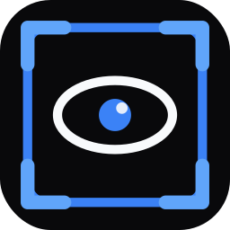

<div align="center">
  

  <h1>VisionKit</h1>

  <p>
    Desktop-приложение для визуализации KITTI-изображений, сравнения Ground Truth и YOLO Predictions,
    а также расчета метрик качества детекции объектов.
  </p>

  <p>
    <a href="https://github.com/Andrei52Lz/ImageViewerDiplom/releases/tag/v1.1.4">
      
    </a>
    
    
    
  </p>
</div>

---

## О проекте

**VisionKit** разработан как гибридное desktop/web-приложение:

- системная и вычислительная часть выполнена на Python;
- пользовательский интерфейс реализован на React + TypeScript;
- desktop-оболочка построена на PySide6/QWebEngineView;
- backend FastAPI запускается автоматически внутри EXE.

Приложение предназначено для просмотра изображений, визуального сравнения bounding boxes и количественной оценки качества детекции объектов.

## Возможности

- загрузка папки с изображениями;
- постраничный просмотр кадров;
- отображение Ground Truth bbox в формате KITTI;
- отображение Prediction bbox в формате YOLO;
- конвертация YOLO bbox из normalized координат в pixel bbox;
- сопоставление изображений, GT и predictions по имени файла;
- расчет TP, FP, FN, Precision, Recall, IoU, AP и mAP@0.5;
- настройка цветов классов;
- светлая и темная темы;
- автономный запуск как Windows EXE.

## Скачать готовую версию

Готовое приложение доступно на странице релиза:

```text
https://github.com/Andrei52Lz/ImageViewerDiplom/releases/tag/v1.1.4
```

Для запуска скачайте:

```text
VisionKit-1.1.4-windows.zip
```

Распакуйте архив в отдельную папку и запустите:

```text
VisionKit.exe
```

Важно: не удаляйте папку `_internal` рядом с `VisionKit.exe`. В ней находятся зависимости приложения.

## Тестовые данные

В релиз добавлен небольшой sample-набор на 250 согласованных кадров:

```text
VisionKit-sample-images.zip
VisionKit-sample-ground-truth.zip
VisionKit-sample-predictions.zip
```

Назначение архивов:

| Архив | Содержимое | Для чего нужен |
| --- | --- | --- |
| `VisionKit-sample-images.zip` | `data_object_image_2\training\image_2` | изображения |
| `VisionKit-sample-ground-truth.zip` | `data_object_label_2\training\label_2` | KITTI Ground Truth |
| `VisionKit-sample-predictions.zip` | `predict-2\labels` | YOLO Predictions |

После распаковки выберите эти папки в приложении:

1. `Загрузить изображения` -> `data_object_image_2\training\image_2`
2. `Загрузить Ground Truth` -> `data_object_label_2\training\label_2`
3. `Загрузить предсказания` -> `predict-2\labels`
4. `Рассчитать метрики`

## Поддерживаемые форматы

### Изображения

```text
.png, .jpg, .jpeg, .bmp, .webp
```

### Ground Truth: KITTI

```text
class truncated occluded alpha x1 y1 x2 y2 ...
```

VisionKit использует `class`, `x1`, `y1`, `x2`, `y2`.

### Predictions: YOLO

```text
class_id x_center y_center width height confidence
```

`confidence` может отсутствовать. В этом случае используется `1.0`.

Class names определяются из `data.yaml`, `data.yml`, `dataset.yaml`, `dataset.yml` или `classes.txt` в папке predictions или в родительской папке. Если mapping не найден, используются стандартные классы KITTI.

## Метрики

VisionKit считает метрики при IoU threshold `0.5`.

Правила расчета:

- predictions сортируются по confidence;
- matching выполняется только внутри одного изображения;
- matching выполняется только внутри одного класса;
- один GT может быть matched только один раз;
- prediction считается TP, если `IoU >= 0.5`;
- unmatched prediction считается FP;
- unmatched GT считается FN;
- AP считается по precision-recall curve;
- mAP@0.5 считается как среднее AP по классам, у которых есть GT.

## Стек

| Часть | Технологии |
| --- | --- |
| Frontend | React, TypeScript, Vite |
| UI | Tailwind CSS, shadcn/ui style components |
| Backend | FastAPI, Pydantic |
| Desktop | PySide6, QWebEngineView |
| Packaging | PyInstaller |
| Image processing | Pillow |

## Структура проекта

```text
app/
  api.py                 FastAPI API, диагностика, выбор папок, выдача файлов
  detection_metrics.py   расчет IoU, AP, mAP, TP/FP/FN
  label_io.py            чтение KITTI/YOLO labels и class names
  main.py                desktop shell, запуск backend, окно PySide6
  schemas.py             Pydantic-схемы backend API

src/
  app/
    App.tsx              главное состояние приложения и интеграция с API
    types.ts             TypeScript-типы bbox, метрик и API
    components/          UI-компоненты приложения

public/
  logo.svg               web logo/favicon
  icon.ico               Windows/EXE icon
```

## Запуск для разработки

Требования:

- Windows 10/11;
- Python 3.11;
- Node.js 18+;
- npm.

Установка зависимостей:

```powershell
npm install
pip install -r requirements.txt
```

Backend:

```powershell
python -m uvicorn app.api:api --host 127.0.0.1 --port 8000
```

Frontend:

```powershell
npm run dev -- --host 127.0.0.1
```

Desktop shell в dev-режиме:

```powershell
$env:VISIONKIT_DEV="1"
python app/main.py
```

## Сборка

Production frontend:

```powershell
npm run build
```

Проверка desktop production без Vite:

```powershell
Remove-Item Env:\VISIONKIT_DEV -ErrorAction SilentlyContinue
python app/main.py
```

Сборка EXE:

```powershell
pyinstaller --noconfirm --windowed --name VisionKit --icon public/icon.ico --add-data "dist;dist" --add-data "public/icon.ico;public" app/main.py
```

Готовое приложение будет создано в:

```text
dist\VisionKit\VisionKit.exe
```

## Диагностика

Лог desktop/backend:

```powershell
Get-Content "$env:LOCALAPPDATA\VisionKit\logs\visionkit.log" -Tail 120
```

Health-check:

```powershell
curl http://127.0.0.1:8000/api/health
```

Python debug:

```powershell
curl http://127.0.0.1:8000/api/debug/python
```

## Частые проблемы

### Порт 8000 занят

VisionKit использует `127.0.0.1:8000`. Если порт занят другим процессом, приложение покажет ошибку запуска backend.

```powershell
netstat -ano | Select-String ":8000"
```

### EXE не обновился после сборки

Перед `npm run build` и PyInstaller закройте запущенный `VisionKit.exe`, иначе Windows может заблокировать папку `dist`.

### Не отображаются изображения

Проверьте:

- выбранная папка содержит поддерживаемые изображения;
- путь к файлам не удален;
- backend отвечает на `/api/health`;
- в логе нет ошибки `/image-file`.

## Release

Текущая версия:

```text
v1.1.4
```

GitHub Release:

```text
https://github.com/Andrei52Lz/ImageViewerDiplom/releases/tag/v1.1.4
```
